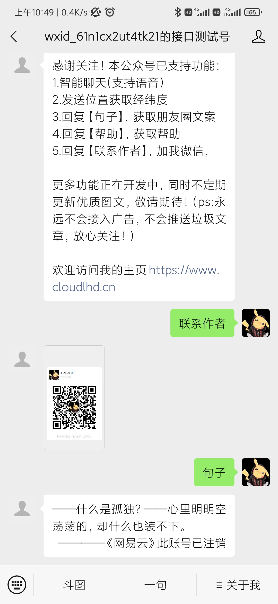
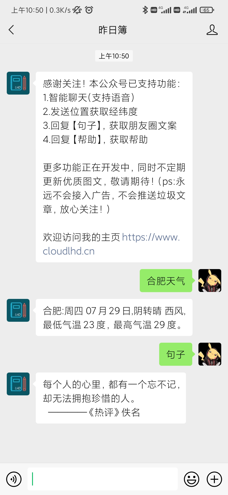

## 微信公众号

微信公众号的后台代码，使用node.js编写，已完成功能：
+ 获取，保存，更新Access_Token
+ 创建删除菜单栏
+ 上传临时素材和永久素材
+ 下载保存图片
+ 接入了图灵智能聊天机器人
+ 斗图接口
+ 优美句子接口

---
支持二次开发
+ 将`config`文件夹下的`config_demo.js`改为`config.js`，并填写你的开发信息
+ 因为微信公众号认证和非认证权限问题，故对回复进行了区分，如果已认证公众号引用`reply_authed.js`文件使用，否则使用默认的`reply.js`，已认证公众号可以创建菜单，调用`wechat.js`里面的`createMenu`方法即可，参考`wechat.js`中被注释的内容。

### 效果图
***测试号（具有完整权限 )***

***未认证号***

---
### 欢迎关注我的公众号，不定期更新功能和技术文章

